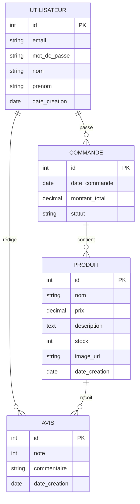
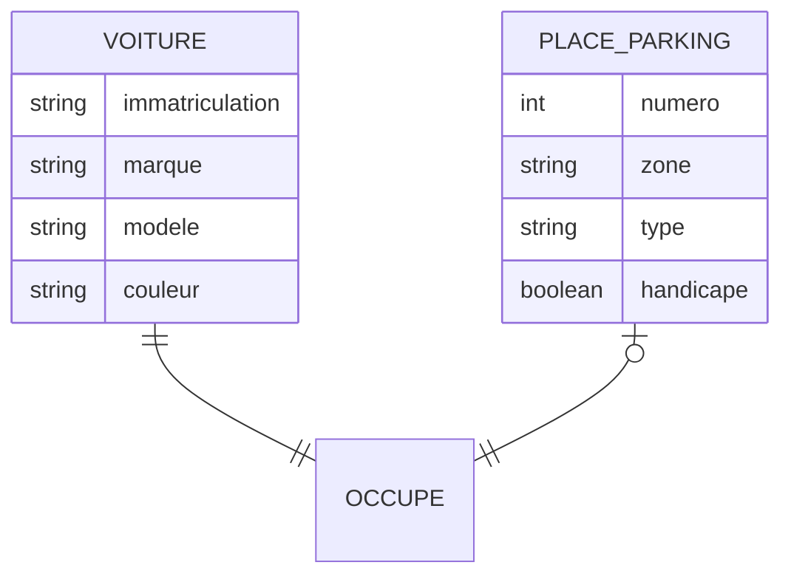
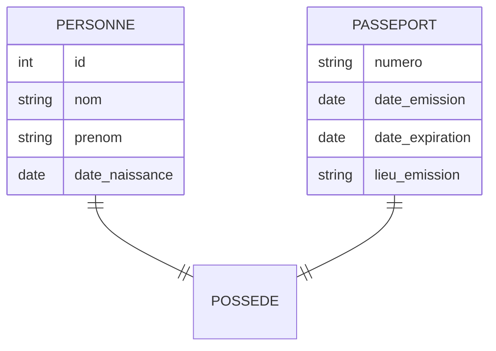
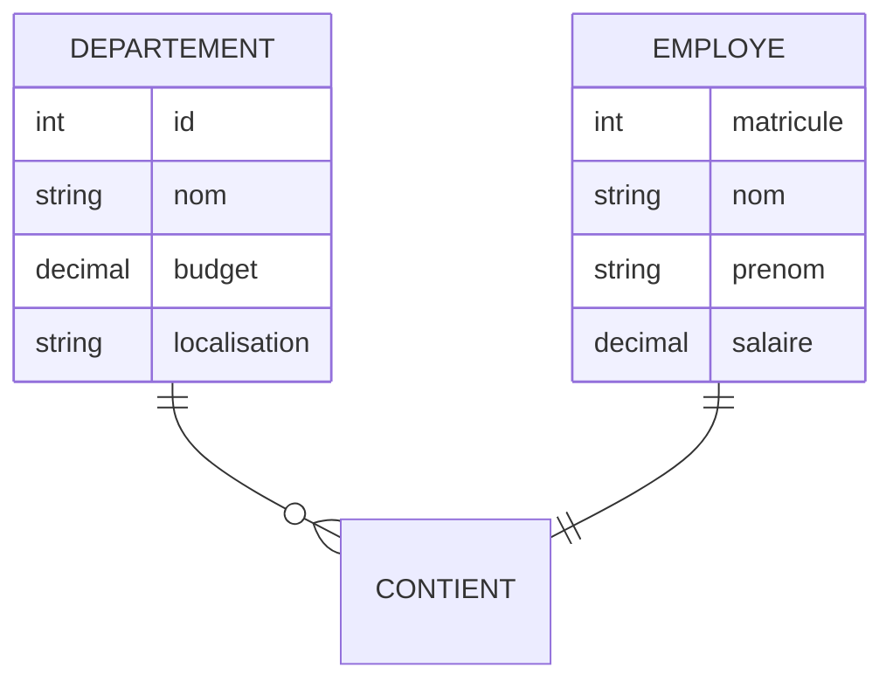
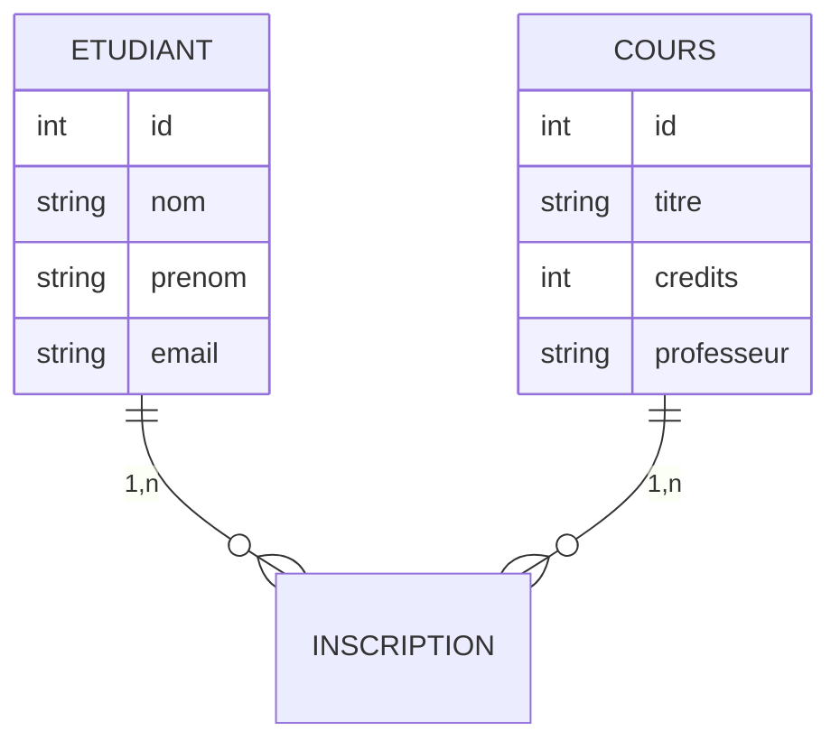
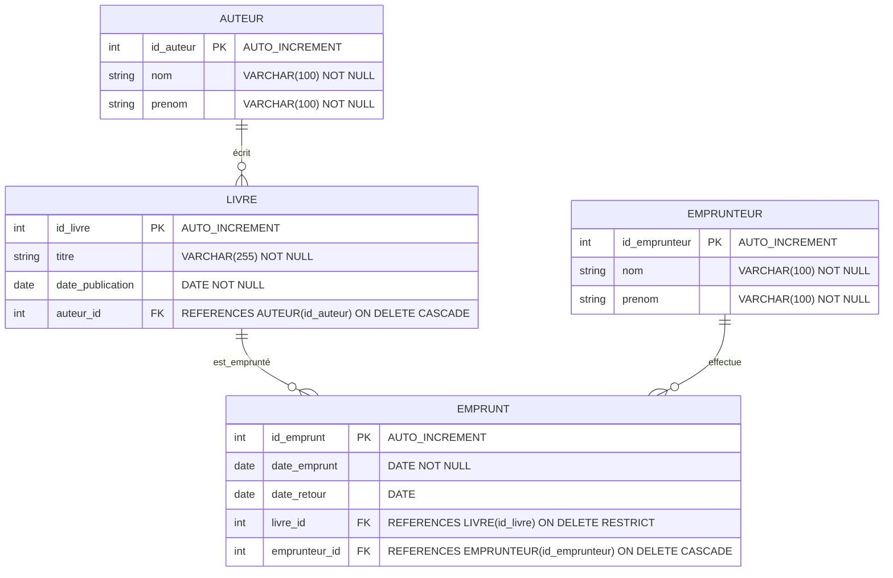

# Module 1 : Fondamentaux des SGBD relationnels
## Objectif : Être capable de construire un MPD afin de construire un script SQL 

1. [Comprendre les concepts clés des bases de données](#concepts-cles)
    - [Histoire et contexte](#histoire-contexte-bdd)
    - [Schéma](#le-schema)
    - [La table et les attributs](#la-table-les-attributs)
    - [Les relations](#les-relations)
    - [Contrainte d'intégrité](#contrainte-integrite)
2. [Analyse du besoin client](#analyse-besoin-client)
    - [Étude de cas](#analyse-besoin-client-etude-cas)
    - [Dictionnaire de données](#dictionnaire-donnees)
3. [Diagramme entité-relation (ERD)](#erd)
    - [Étude de cas](#erd-etude-cas)
4. [Modèle conceptuel des données (MCD)](#mcd)
    - [Différence entre ERD-MCD](#erd-to-mcd)
    - [Les cardinalités](#cardinalites)
5. [Modèle logique des données (MLD)](#mld)
    - [Différence entre MCD-MLD](#mcd-to-mld)
    - [Clé étrangère](#mld-foreign-key)
6. [Modèle physique des données (MPD)](#mpd)
    - [Différence entre MLD-MPD](#mld-to-mpd)
    - [Types de données](#mpd-types-donnees)
    - [Contraintes physiques](#mpd-contraintes)

<a id="concepts-cles"></a>
## 1. Comprendre les concepts clés des bases de données

<a id="histoire-contexte-bdd"></a>
### Histoire et contexte

Les bases de données relationnelles sont apparues dans les années 1970 grâce à **Edgar Frank Codd** (1923-2003). Il a publié l'article fondateur : *"A Relational Model of Data for Large Shared Data Banks"* qui a révolutionné la façon de stocker et d'organiser les données.

Avant cette innovation, les données étaient stockées dans des fichiers séparés, rendant leur gestion complexe et leur mise à jour difficile. Le modèle relationnel a apporté une solution structurée et cohérente.

---
### Qu'est-ce qu'une base de données relationnelle ?

#### **Définition**:
Une base de données relationnelle stocke et donne accès à des données **liées entre elles**. Elle repose sur le modèle relationnel, qui représente les données sous forme de **tables**.

**Pourquoi "relationnelle" ?** Parce que les données sont organisées en tables qui peuvent être **mises en relation** les unes avec les autres grâce à des liens logiques.

**Avantages principaux :**
- Évite la redondance des données
- Garantit la cohérence des informations
- Facilite la maintenance et les mises à jour
- Permet des requêtes complexes sur plusieurs tables

---
<a id="le-schema"></a>
### Le schéma

#### **Définition**:
Le schéma définit la **structure** de la base de données. C'est comme le plan d'architecte d'un bâtiment.

**Le schéma comprend :**
- Tables et leurs colonnes
- Types de données (texte, nombre, date...)
- Relations entre les tables
- Contraintes d'intégrité

**Rôle du schéma :** Il sert de plan d'organisation pour garantir la cohérence et l'intégrité des données. Le schéma est défini avant la création des données et reste stable dans le temps.

---
<a id="la-table-les-attributs"></a>
### La table et les attributs

#### **Définition**:
Les tables sont des structures à deux dimensions, comme un **tableau Excel**, qui organisent les données de manière structurée.

**Composition d'une table :**
- **Lignes** = enregistrements (ou tuples) : chaque ligne représente une occurrence
- **Colonnes** = attributs (ou champs) : chaque colonne représente une caractéristique

Chaque table représente une **entité** spécifique du monde réel (utilisateur, produit, commande...).

Une table est composée d'**attributs** qui décrivent la structure et les caractéristiques de l'entité représentée.

#### Exemple concret : Table Utilisateur

Imaginons un site web qui gère des utilisateurs :

**Structure de la table Utilisateur :**

| **Attribut** | **Type** | **Description** |
|--------------|----------|-----------------|
| `id` | INT | Identifiant unique (clé primaire) |
| `pseudo` | VARCHAR | Nom d'utilisateur |
| `email` | VARCHAR | Adresse email |
| `password` | VARCHAR | Mot de passe chiffré |
| `date_creation` | DATE | Date de création du compte |

**Exemple de données :**

| id | pseudo | email | password | date_creation |
|----|--------|-------|----------|---------------|
| 1 | alice_martin | alice@email.com | $2y$10$... | 2024-01-15 |
| 2 | bob_dupont | bob@email.com | $2y$10$... | 2024-01-16 |

---
<a id="les-relations"></a>

### Les relations entre tables

#### **Définition**:
Les relations créent des **liens logiques** entre les tables via des clés étrangères. C'est ce qui rend les bases de données "relationnelles".

#### Clé étrangère (Foreign Key - FK)

#### **Définition**:
Attribut dans une table qui **référence** la clé primaire d'une autre table.

**Rôle :** Créer un lien entre deux tables pour établir une relation et maintenir la cohérence des données.

#### Clé primaire (Primary Key - PK)

#### **Définition**:
Attribut dans une table qui définit un identifiant **unique** pour chaque enregistrement.

**Caractéristiques :**
- **Unique** : Aucune valeur dupliquée
- **Non nulle** : Toujours renseignée
- **Stable** : Ne change jamais
- **Minimale** : Utilise le moins d'attributs possible

**Exemple :** Le numéro de sécurité sociale est unique pour chaque personne et ne change jamais.

<a id="contrainte-integrite"></a>
### Contraintes d'intégrité

Les contraintes garantissent la **cohérence** et la **qualité** des données :

#### Types de contraintes :

1. **Intégrité d'entité** : Chaque table doit avoir une clé primaire
2. **Intégrité référentielle** : Empêche les références vers des enregistrements inexistants
3. **Intégrité de domaine** : Garantit que les valeurs respectent le type et les règles définies

**Exemple d'intégrité référentielle** : Impossible d'ajouter une commande avec un utilisateur qui n'existe pas dans la table Utilisateur.

---
<a id="analyse-besoin-client"></a>

## 2. Analyse du besoin client 

### Comprendre les besoins utilisateurs

L'analyse du besoin est la première étape cruciale dans la conception d'une base de données. Elle consiste à recueillir, analyser et structurer les besoins exprimés par le client.

**Objectifs de cette phase :**
- Identifier toutes les données nécessaires
- Comprendre les règles métier
- Définir les fonctionnalités attendues
- Anticiper les évolutions futures

<a id="analyse-besoin-client-etude-cas"></a>
### Étude de cas : Site e-commerce artisanal

**Demande client :**

*"Bonjour, je voudrais un site où mes clients pourront commander nos produits artisanaux. Il faut qu'ils puissent créer un compte avec leur email et un mot de passe, et modifier leur profil plus tard. Sur la page produit, on doit voir le prix, la description et les photos. Quand un client ajoute un article au panier, il doit pouvoir modifier les quantités avant de payer. J'ai besoin de voir toutes les commandes dans l'administration, avec le détail de ce qui a été acheté et par qui. Oh et surtout, il faut que ce soit sécurisé pour les paiements ! Les clients doivent recevoir un email de confirmation après achat. Et si possible, qu'ils puissent laisser des avis sur les produits..."*

**Analyse de la demande :**

De cette description, nous identifions plusieurs entités :
- **Utilisateurs** : gestion des comptes clients
- **Produits** : catalogue avec prix, descriptions, images
- **Commandes** : historique des achats
- **Avis** : commentaires clients sur les produits

---
<a id="dictionnaire-donnees"></a>
### Dictionnaire de données

Une fois le besoin utilisateur analysé, il est important d'établir un dictionnaire de données pour mieux se représenter les données à créer.

#### **Définition**:
Référentiel structuré qui recense toutes les **données élémentaires** (atomiques) du système d'information.

**En termes simples :** Le dictionnaire de données représente l'inventaire exhaustif de TOUTES les données que le système doit pouvoir manipuler.

#### Notion de donnée atomique

**Principe :** Les données doivent être **indivisibles** et avoir un **sens complet** par elles-mêmes.

**Exemple incorrect :** "Adresse" n'est PAS atomique
- Peut être divisée en : numéro de rue, nom de rue, code postal, ville

**Exemple correct :** Données atomiques
- `numero_rue` : 42
- `nom_rue` : "Rue de la Paix"  
- `code_postal` : 75001
- `ville` : "Paris"

**Pourquoi cette distinction est-elle importante ?**
- Facilite les recherches et les tris
- Permet des requêtes plus précises
- Évite la redondance d'informations

#### Dictionnaire de données de notre cas d'étude

| **Entité** | **Attribut** | **Type** | **Taille** | **Description** | **Obligatoire** |
|------------|--------------|----------|------------|-----------------|-----------------|
| **Utilisateur** | id | Entier | - | Identifiant unique | Oui |
| | email | Texte | 255 | Adresse email unique | Oui |
| | mot_de_passe | Texte | 255 | Mot de passe chiffré | Oui |
| | nom | Texte | 100 | Nom de famille | Oui |
| | prenom | Texte | 100 | Prénom | Oui |
| | date_creation | Date | - | Date de création du compte | Oui |
| **Produit** | id | Entier | - | Identifiant unique | Oui |
| | nom | Texte | 200 | Nom du produit | Oui |
| | prix | Décimal | 10,2 | Prix unitaire en euros | Oui |
| | description | Texte long | - | Description détaillée | Non |
| | stock | Entier | - | Quantité disponible | Oui |
| | image_url | Texte | 500 | Lien vers l'image | Non |
| | date_creation | Date | - | Date d'ajout du produit | Oui |
| **Commande** | id | Entier | - | Identifiant unique | Oui |
| | date_commande | Date | - | Date de passation | Oui |
| | montant_total | Décimal | 10,2 | Montant total TTC | Oui |
| | statut | Texte | 50 | Statut de la commande | Oui |
| | utilisateur_id | Entier | - | Référence vers l'utilisateur | Oui |
| **Avis** | id | Entier | - | Identifiant unique | Oui |
| | note | Entier | - | Note sur 5 | Oui |
| | commentaire | Texte | 1000 | Commentaire de l'avis | Non |
| | date_creation | Date | - | Date de création de l'avis | Oui |

<a id="erd"></a>
## 3. Diagramme entité-relation (ERD)

#### **Définition**:
Représentation **visuelle** qui modélise les entités, leurs attributs et les relations entre elles dans un système d'information.

**L'ERD comprend :**
- **Entités** : Objets du monde réel (Utilisateur, Produit, Commande...)
- **Attributs** : Caractéristiques des entités (nom, prix, date...)
- **Relations** : Liens entre les entités

**Objectif :** Fournir une vue d'ensemble claire et compréhensible de la structure des données avant leur implémentation technique.

#### Comment construire un ERD

**Étape 1 : Identifier les entités**
- Dessiner un rectangle par entité
- Inscrire le nom de l'entité en titre

**Étape 2 : Lister les attributs**
- Format : `[nom_attribut] [type] [PK]`
- PK = Primary Key (Clé primaire)

**Étape 3 : Définir les relations**
- Tracer des liens entre les entités
- Nommer ces liens avec un verbe à l'infinitif

#### Règles fondamentales

- Toute entité doit avoir **au moins un attribut**
- Une relation connecte **2 entités minimum**
- Les attributs caractérisent **une seule entité**
- Chaque entité doit avoir une **clé primaire**

<a id="erd-etude-cas"></a>
### Étude de cas : Site e-commerce artisanal

En reprenant notre dictionnaire de données établi pendant la récupération des besoins client, nous allons créer le diagramme entité-relation :


[Retour au sommaire](#sommaire)
**Notes importantes :**

1. **Pourquoi image_url au lieu d'image ?** 
   - Stocker l'URL est plus efficace que stocker le fichier binaire
   - Facilite la gestion et le cache des images
   - Permet l'hébergement externe des médias

2. **Pourquoi l'avis est une entité séparée ?**
   - Un utilisateur peut laisser plusieurs avis sur différents produits
   - Un produit peut recevoir plusieurs avis de différents utilisateurs
   - Permet d'ajouter des métadonnées (date, note, etc.)

3. **Comment connait-on la quantité de produit commandé ?**
   - Cette information sera gérée plus tard dans le modèle logique
   - Pour l'instant, nous nous concentrons sur les entités principales et leurs relations

<a id="mcd"></a>
## 4. Modèle conceptuel des données (MCD)

#### **Définition**:
Un MCD (Modèle Conceptuel de Données) est une représentation schématique qui illustre les données d'un système d'information de manière **logique et organisée**. Il sert à structurer et à visualiser ces données de façon compréhensible, indépendamment de toute considération technique.

**Caractéristiques du MCD :**
- **Abstrait** : Ne dépend pas de la technologie utilisée
- **Complet** : Représente toutes les données métier
- **Cohérent** : Respecte les règles de gestion
- **Stable** : Peu sensible aux évolutions techniques

<a id="erd-to-mcd"></a>

### Différence entre ERD et MCD

ERD (Diagramme Entité Relation) et MCD (Modèle Conceptuel de Données) sont très proches dans leur principe, mais se distinguent par leur approche :

| **Critère** | **ERD** | **MCD** |
|-------------|---------|---------|
| **Origine** | Approche anglo-saxonne | Méthode Merise (française) |
| **Focus** | Entités et relations | Entités, associations et cardinalités |
| **Notation** | Varies selon l'outil | Normalisée (Merise) |
| **Cardinalités** | Souvent implicites | Toujours explicites et formalisées |

Dans la méthode Merise, le passage de l'ERD au MCD s'accompagne de la **formalisation précise des cardinalités** sur les associations.

<a id="cardinalites"></a>

### Les cardinalités

#### **Définition**:
La **cardinalité**, dans les schémas relationnels, sert à définir le nombre minimum et maximum d'occurrences qu'une entité peut avoir dans une relation avec une autre entité. Cette notion est utilisée par la modélisation **Merise et UML**.

Les cardinalités définissent les **règles quantitatives** d'une relation entre deux entités.

**Question clé :** Combien d'instances d'une entité peuvent être liées à combien d'instances d'une autre entité ?

#### Tableau des cardinalités

| **Cardinalité** | **Signification** | **Exemple concret** |
|-----------------|-------------------|---------------------|
| `(0,1)` | Optionnel - Unique | Une personne peut avoir 0 ou 1 permis de conduire |
| `(1,1)` | Obligatoire - Unique | Une personne a exactement 1 passeport |
| `(0,n)` | Optionnel - Multiple | Un département peut avoir 0 ou plusieurs employés |
| `(1,n)` | Obligatoire - Multiple | Un employé travaille dans au moins 1 département |

#### Méthode pour déterminer les cardinalités

**Questions à se poser :**
1. Une occurrence de l'entité A peut-elle exister sans être liée à l'entité B ?
2. Une occurrence de l'entité A peut-elle être liée à plusieurs occurrences de l'entité B ?
3. Même questions dans l'autre sens (B vers A)

---

## Cas concrets par type de relation

### Relation (0,1) : Optionnel-Unique

**Contexte :** Système de parking automatisé (MCD)

**Scénario :** Un parking indique les places disponibles via un panneau d'affichage.



**Explication des cardinalités :**
- **Côté VOITURE** `||` : Une voiture occupe exactement 1 place (cardinalité 1,1) quand elle participe à la relation
- **Côté PLACE_PARKING** `|o` : Une place peut être occupée par 0 ou 1 voiture (cardinalité 0,1)
- **Relation OCCUPE** : Entité d'association qui matérialise l'occupation d'une place par une voiture

**Règles métier :**
- Une voiture peut ne pas être garée dans le parking (elle circule ou est garée ailleurs)
- Une place peut être libre (0 voiture) ou occupée par une seule voiture maximum (1 voiture)
- Une voiture ne peut occuper qu'une seule place à la fois dans ce parking
- Seules les voitures effectivement garées participent à la relation OCCUPE

**Spécificités du MCD :**
- L'entité d'association OCCUPE porte des informations temporelles (heure d'arrivée, départ prévu)
- La cardinalité (0,1) côté PLACE_PARKING permet de gérer les places libres
- La cardinalité (1,1) côté VOITURE concerne uniquement les voitures garées dans le système
- Au passage en MLD, cette relation sera généralement résolue par une clé étrangère optionnelle

### Relation (1,1) : Obligatoire-Unique

**Contexte :** Système de gestion de passeports (MCD)

**Scénario :** Chaque personne a un et un seul passeport, chaque passeport appartient à une et une seule personne.



**Explication des cardinalités :**
- **Côté PERSONNE** `||` : Une personne possède exactement 1 passeport (cardinalité 1,1)
- **Côté PASSEPORT** `||` : Un passeport appartient à exactement 1 personne (cardinalité 1,1)
- **Relation POSSEDE** : Entité d'association qui matérialise le lien entre PERSONNE et PASSEPORT

**Règles métier :**
- Toute personne doit avoir un passeport (obligation)
- Un passeport ne peut appartenir qu'à une seule personne (unicité)
- Relation bijective (correspondance un-à-un parfaite)
- Aucune personne ne peut exister sans passeport dans le système
- Aucun passeport ne peut exister sans être rattaché à une personne

**Spécificités du MCD :**
- L'entité d'association POSSEDE peut porter des attributs supplémentaires (date d'attribution, statut, etc.)
- Les cardinalités (1,1) des deux côtés créent une contrainte forte
- Au passage en MLD, cette relation pourra être résolue par fusion des entités ou par clé étrangère

#### Le rôle des verbes dans les relations

**Question :** À quoi sert le verbe écrit sur le lien de la relation ?

**Réponse :** Le verbe décrit la **nature de la connexion** entre les entités et facilite la lecture du schéma en donnant du sens métier à la relation.

**Règles d'écriture :**
- Toujours utiliser l'**infinitif** (verbe non conjugué)
- Choisir des verbes **actionnels et précis**
- Indiquer le **sens de lecture** de la relation
- Refléter la réalité métier de l'association

**Exemples de verbes :**
- `possède`, `appartient`, `contient`, `gère`, `inscrit`, `commande`, `publie`, `achète`, `supervise`, `habite`

**Dans notre exemple :**
- PERSONNE **possède** PASSEPORT (sens de lecture naturel)
- La relation POSSEDE exprime clairement le lien de propriété/appartenance

### Relation (1,n) : Obligatoire-Multiple

**Contexte :** Système de gestion des ressources humaines (MCD)

**Scénario :** Un département contient plusieurs employés, chaque employé appartient à un département.



**Explication des cardinalités :**
- **Côté DEPARTEMENT** `||` : Un département existe toujours (obligatoire)
- **Côté EMPLOYE** `o{` : Un département peut contenir 0 ou plusieurs employés via la relation CONTIENT
- **Côté EMPLOYE vers CONTIENT** `||` : Chaque employé est obligatoirement dans un département
- **Côté DEPARTEMENT vers CONTIENT** `||` : La relation existe toujours pour un département donné

**Question :** Est-on obligé d'avoir un employé pour créer un département ?

**Réponse :** Non ! La cardinalité `o{` côté employé indique qu'un département peut exister sans employé (par exemple, un nouveau département en cours de recrutement). L'entité DEPARTEMENT peut exister indépendamment de l'existence d'occurrences dans la relation CONTIENT.

**Règles métier :**
- Un employé appartient obligatoirement à un seul département (cardinalité 1,1)
- Un département peut avoir zéro, un ou plusieurs employés (cardinalité 0,n)
- Le département existe indépendamment de ses employés
- La relation CONTIENT peut porter des attributs supplémentaires (date d'affectation, poste, etc.)

**Spécificités du MCD :**
- L'entité d'association CONTIENT permet de porter des informations sur la relation
- Les cardinalités sont exprimées au niveau conceptuel
- Le passage au MLD transformera cette relation en clé étrangère

---

# Relation (n,n) : Multiple-Multiple

**Contexte :** Système de gestion universitaire

**Scénario :** Des étudiants s'inscrivent à des cours. Un étudiant peut suivre plusieurs cours, et un cours peut accueillir plusieurs étudiants.

## Problème : Relation directe impossible

Essayons d'abord une relation directe :


**Pourquoi ça ne marche pas ?**

Imaginons ces données :
- Alice suit : Mathématiques + Histoire  
- Bob suit : Mathématiques + Biologie
- Carol suit : Histoire

**Comment stocker plusieurs cours par étudiant dans une seule colonne ?** 

**Table Etudiant (tentative incorrecte) :**
| **id** | **nom** | **cours_suivis** |
|--------|---------|------------------|
| 1 | Alice | Maths, Histoire ??? |
| 2 | Bob | Maths, Biologie ??? |

**Problème :** Une colonne ne peut contenir qu'une seule valeur atomique selon les règles de normalisation !

## Solution : Entité-Association

**MCD nécessaire :**



**Explication des cardinalités :**

1. **ETUDIANT → INSCRIPTION** `(1,n)` :
   - Un étudiant peut avoir 1 ou plusieurs inscriptions
   - Une inscription concerne exactement 1 étudiant

2. **COURS → INSCRIPTION** `(1,n)` :
   - Un cours peut avoir 1 ou plusieurs inscriptions  
   - Une inscription concerne exactement 1 cours

## Comprendre l'entité-association

**Analogie :** Imaginez que l'inscription est un **contrat** qui relie un étudiant à un cours :
- Chaque contrat est unique
- Un étudiant peut avoir plusieurs contrats
- Un cours peut être lié à plusieurs contrats

**L'entité-association INSCRIPTION :**
- Permet de matérialiser la relation entre ETUDIANT et COURS
- Porte les informations propres à cette relation
- Résout le problème de la relation (n,n)

## Données d'exemple

**Entité ETUDIANT :**
| **id** | **nom** | **prenom** |
|--------|---------|------------|
| 1 | Martin | Alice |
| 2 | Dupont | Bob |
| 3 | Durand | Carol |

**Entité COURS :**
| **id** | **titre** | **credits** |
|--------|-----------|-------------|
| 1 | Mathématiques | 6 |
| 2 | Histoire | 4 |
| 3 | Biologie | 5 |

**Entité-Association INSCRIPTION :**
| **etudiant_id** | **cours_id** | **date_inscription** | **note_finale** |
|-----------------|--------------|---------------------|-----------------|
| 1 | 1 | 2024-09-01 | 15.5 |
| 1 | 2 | 2024-09-01 | 14.0 |
| 2 | 1 | 2024-09-02 | 16.0 |
| 2 | 3 | 2024-09-02 | 13.5 |
| 3 | 2 | 2024-09-03 | 17.0 |
**Lecture des données :**
- Alice Martin : Mathématiques (15.5/20) + Histoire (14.0/20)
- Bob Dupont : Mathématiques (16.0/20) + Biologie (13.5/20)  
- Carol Durand : Histoire (17.0/20)

### De l'ERD au MCD (Modèle Conceptuel de Données)

1. **Entités → Concepts métier**
Chaque entité de l'ERD devient une **entité-concept** dans le MCD, représentant un objet métier clé (ex: `Client`, `Commande`)[^5].
2. **Attributs → Propriétés descriptives**
Les caractéristiques des entités deviennent des **attributs** dans le MCD (ex: `Nom_Client`, `Date_Commande`)[^5][^4].
3. **Relations → Associations sémantiques**
Les liens entre entités sont formalisés en **relations** avec cardinalités (ex: `1-N`, `N-N`). Chaque relation porte un verbe explicite (ex: "Passer" entre `Client` et `Commande`)[^6][^5].
---
<a id="mld"></a>

## 5. Modèle logique des données (MLD)

#### **Définition**:
Un modèle logique de données (MLD) est la représentation des données d'un système d'information qui prend en compte le **modèle technologique** qui sera utilisé pour leur gestion (relationnel, objet, etc.).

Le MLD traduit le modèle conceptuel en une structure **organisée et optimisée** pour l'implémentation dans un SGBD relationnel.

<a id="mcd-to-mld"></a>

### Différence entre MCD et MLD

Le MCD est une vision conceptuelle et indépendante de la technique, tandis que le MLD adapte ce modèle à une logique de gestion des données, en vue d'une implémentation future.

**Pour faire simple** Le MLD est un schéma de conception de base de données mais qui prend déjà
en compte les contraintes de la technologie choisi (ex : SQL).

<a id="mld-foreign-key"></a>

### Clé étrangère

Nous avons parlé de la clé étrangère qui permet de lier deux tables ensemble. Mais concrétement comment cela se passe ? 

#### Pour créer une relation entre deux tables, deux cas de figure se présentent à vous :

1. La relation est simple (un pour un , un pour plusieurs)

    Dans ce cas il suffit d'ajouter un champs étranger qui redirige vers la table à relier.
    
    #### Exemple : Voiture - Parking

    |`Voiture`|Nom du champs|Type du champs|FK-PK|
    |-------|:-----------:|:------------:|:---:|
    ||immatriculation|string|PK|
    ||marque|string||
    ||modele|string||


    |`Parking`|Nom du champs|Type du champs|FK-PK|
    |-------|:-----------:|:------------:|:---:|
    ||id|int|PK|
    ||zone|string||
    ||voiture_immatriculation|string|FK|

    Dans cet exemple nous avons ajouté un champs `voiture_immatricualtion` qui fait référence à
    l'attribut `immatriculation` dans la table `voiture`.

    #### Règles fondamentales
    - La clé étrangère doit être du même type que le champs dans la table à relier
    - Nommé la clef étrangère sous ce format : <nom de la table à relier (au singulier)>_<nom de la clé primaire de la table à relier>, ici voiture_immatriculation.

2. La relation est complexe (1,n) (n,n)
    
    Dans ce cas il faut ajouter une table intermédiaire.

    #### Exemple : Etudiant - Cours - Inscription

    |`Etudiant`|Nom du champs|Type du champs|FK-PK|
    |-------|:-----------:|:------------:|:---:|
    ||immatriculation|string|PK|
    ||marque|string||
    ||modele|string||


    |`Cours`|Nom du champs|Type du champs|FK-PK|
    |-------|:-----------:|:------------:|:---:|
    ||id|int|PK|
    ||titre|string||
    ||credits|int||
    ||professeur|string||

    
    |`Inscription`|Nom du champs|Type du champs|FK-PK|
    |-------|:-----------:|:------------:|:---:|
    ||crouse_id|int|PK-FK|
    ||etudiant_id|int|PK-FK|
    ||date|date_inscription|
    ||note_finale|decimal| 

    ```mermaid
    erDiagram
    ETUDIANT ||--o{ INSCRIPTION : "effectue"
    COURS ||--o{ INSCRIPTION : "accueille"
    ETUDIANT {
        int id PK
        string nom
        string prenom
        string email
    }
    COURS {
        int id PK
        string titre
        int credits
        string professeur
    }
    INSCRIPTION {
        int etudiant_id PK
        int cours_id PK
        date date_inscription
        decimal note_finale
    }
    ```

#### Clé primaire composite

**Question :** Pourquoi la table INSCRIPTION possède-t-elle deux clés primaires ?

**Réponse :**

1. **Rôle d'une clé primaire :**
   - Garantir que chaque enregistrement est **unique**
   - Permettre l'identification sans ambiguïté

2. **Qu'est-ce qui rend une inscription unique ?**
   - La **combinaison** étudiant + cours
   - Un même étudiant ne peut pas s'inscrire deux fois au même cours

**Exemple :**
- Valide : Alice s'inscrit aux Mathématiques
- Invalide : Alice s'inscrit une deuxième fois aux Mathématiques

**Note :** Une clé primaire composée de plusieurs attributs se nomme une **clé composite** ou **clé composée**.

### Du MCD au MLD (Modèle Logique de Données)

4. **Entités → Tables**
Chaque entité du MCD génère une **table** dans le MLD. Son identifiant devient **clé primaire** (PK)[^1][^4].
5. **Relations 1-N → Clés étrangères**
Pour une relation `1-N`, la PK de l'entité côté `N` devient **clé étrangère** (FK) dans la table côté `1`[^1].
*Exemple* : Une relation `Département (1) - Employé (N)` ajoute `ID_Département` (FK) dans la table `Employé`.
6. **Relations N-N → Tables d'association**
Une relation `N-N` crée une **nouvelle table** avec :
    - Les PK des deux entités comme FK
    - Les attributs de la relation
    - Une PK composée des deux FK[^1][^4].
7. **Relations 0.1-N → FK nullable**
Si la cardinalité minimale est `0`, la FK est **nullable** (non obligatoire)[^1].
8. **Héritage → Tables liées**
Une spécialisation (ex: `Personne → Employé`) génère :
    - Une table pour l'entité générique (`Personne`)
    - Des tables pour les sous-entités (`Employé`), liées par FK à la table générique[^1].

---

<a id="mpd"></a>

## 6. Modèle physique des données (MPD)

<a id="mld-to-mpd"></a>

### Différence entre MLD et MPD

- Types de données précis pour chaque colonne (ex : VARCHAR(255), INT, DATE).
- Taille des champs (ex : VARCHAR(50)).
- Contraintes d'intégrité techniques (NOT NULL, UNIQUE, CHECK, etc.).
- Clés étrangères et gestion des relations (FOREIGN KEY, REFERENCES).
- Index pour optimiser les performances.
- Options spécifiques au SGBD (auto-incrément, encodage, moteur de stockage, etc.).

> Le MPD est donc le schéma le plus détaillé, prêt à être traduit en instructions SQL pour la création physique de la base de données.

Prenons l’exemple d’un système de gestion de bibliothèque. Voici comment on peut représenter le MPD, en explicitant les types, les clés primaires et étrangères :



#### 1. Détail des entités et attributs

##### LIVRE

- `id_livre` : `int`, **clé primaire**, `AUTO_INCREMENT`  
  → Identifiant unique, généré automatiquement.

- `titre` : `VARCHAR(255)` **NOT NULL**  
  → Titre du livre, obligatoire, jusqu’à 255 caractères.

- `date_publication` : `DATE` **NOT NULL**  
  → Date de publication du livre, obligatoire.

- `auteur_id` : `int`, **clé étrangère**, `REFERENCES AUTEUR(id_auteur) ON DELETE CASCADE`  
  → Référence vers l’auteur du livre. Si l’auteur est supprimé, tous ses livres le sont aussi.

---

##### AUTEUR

- `id_auteur` : `int`, **clé primaire**, `AUTO_INCREMENT`

- `nom` : `VARCHAR(100)` **NOT NULL**

- `prenom` : `VARCHAR(100)` **NOT NULL**  
  → Les auteurs sont identifiés par un id unique, et leur nom/prénom sont obligatoires.

---

##### EMPRUNTEUR

- `id_emprunteur` : `int`, **clé primaire**, `AUTO_INCREMENT`

- `nom` : `VARCHAR(100)` **NOT NULL**

- `prenom` : `VARCHAR(100)` **NOT NULL**  
  → Identifie chaque emprunteur, avec nom et prénom obligatoires.

---

##### EMPRUNT

- `id_emprunt` : `int`, **clé primaire**, `AUTO_INCREMENT`

- `date_emprunt` : `DATE` **NOT NULL**

- `date_retour` : `DATE` *(optionnelle)*

- `livre_id` : `int`, **clé étrangère**, `REFERENCES LIVRE(id_livre) ON DELETE RESTRICT`

- `emprunteur_id` : `int`, **clé étrangère**, `REFERENCES EMPRUNTEUR(id_emprunteur) ON DELETE CASCADE`  
  → Un emprunt lie un livre à un emprunteur, avec la date d’emprunt (obligatoire) et la date de retour (facultative).

---

#### 2. Analyse des relations et contraintes d'intégrité

- **LIVRE → EMPRUNT** :  
  Un livre peut être emprunté plusieurs fois.  
  La suppression d’un livre est restreinte (`ON DELETE RESTRICT`) si des emprunts existent.

- **AUTEUR → LIVRE** :  
  Un auteur peut avoir écrit plusieurs livres.  
  Si un auteur est supprimé, tous ses livres le sont aussi (`ON DELETE CASCADE`).

- **EMPRUNTEUR → EMPRUNT** :  
  Un emprunteur peut effectuer plusieurs emprunts.  
  Si un emprunteur est supprimé, tous ses emprunts sont supprimés (`ON DELETE CASCADE`).

---

#### 3. Pourquoi ce schéma est-il un MPD ?

- Types précis (`VARCHAR(255)`, `DATE`, `INT`)
- Contraintes techniques (`NOT NULL`, `AUTO_INCREMENT`, `ON DELETE CASCADE/RESTRICT`)
- Adapté à un SGBD : prêt à être traduit en SQL

---

#### 4. Points à retenir

- Chaque table a une **clé primaire (PK)** auto-incrémentée pour garantir l’unicité.
- Les **clés étrangères (FK)** assurent l’intégrité référentielle et définissent le comportement lors des suppressions.
- Les **types** et **contraintes** garantissent la cohérence et la qualité des données.
- Ce modèle est prêt à être transformé en **script SQL** pour créer la base de données dans un SGBD.

### Du MLD au MPD (Modèle Physique de Données)

9. **Adaptation au SGBD cible**
Chaque table du MLD est implémentée avec :
    - Des **types de données spécifiques** (ex: `VARCHAR(50)` au lieu de "texte")[^4].
    - Des **contraintes techniques** (NOT NULL, UNIQUE, CHECK)[^2][^4].
10. **Optimisation des performances**
Ajout d'**index** sur les colonnes fréquemment interrogées et définition de **stratégies de stockage** (partitionnement, compression)[^3][^4].
11. **Gestion des dépendances**
Création explicite des **clés étrangères** avec règles de `ON DELETE/UPDATE` (CASCADE, SET NULL)[^2][^4].
12. **Intégration des spécificités SGBD**
Utilisation de fonctionnalités avancées du SGBD (ex: moteurs de stockage dans MySQL, schémas dans PostgreSQL)[^3][^4].


<div style="text-align: center">⁂</div>

[^1]: https://www.9raytifclick.com/cours/merise-mld/

[^2]: https://www.smartmodel.ch/home/comment/MLDR-MPDR

[^3]: https://www.urbanisation-si.com/vous-cherchez-des-outils-pour-gerer-le-mapping-entre-les-objets-metiers-et-une-base-de-donnees-relationnelle-generer-les-scripts-sql-et-produire-du-code-a-partir-de-vos-modeles-metiers-obeo-isd-s1-ep5

[^4]: https://www.solidpepper.com/blog/modele-physique-de-donnees-mpd-definition-enjeux-exemple

[^5]: https://www.cartelis.com/data-engineering/modele-conceptuel-de-donnees-mcd-definition-fonctionnement/

[^6]: https://help.sap.com/docs/SAP_POWERDESIGNER/856348b84a7c479489d5172a630f014d/c7c33cbe6e1b101487c2bf53c936d24f.html?locale=fr-FR

[^7]: https://help.sap.com/doc/0bd76ef18ee64301a040f58ee25aa511/16.6.1/fr-FR/modelisation_donnees.pdf

[^8]: http://bliaudet.free.fr/IMG/pdf/modelisation-BDR-P2-relation-un-plusieurs.pdf

[^9]: https://www.youtube.com/watch?v=gLCk3V09U6w

[^10]: https://provencher.csscotesud.gouv.qc.ca/wp-content/uploads/sites/8/2024/10/Normes-regles-de-passage-24-25.pdf