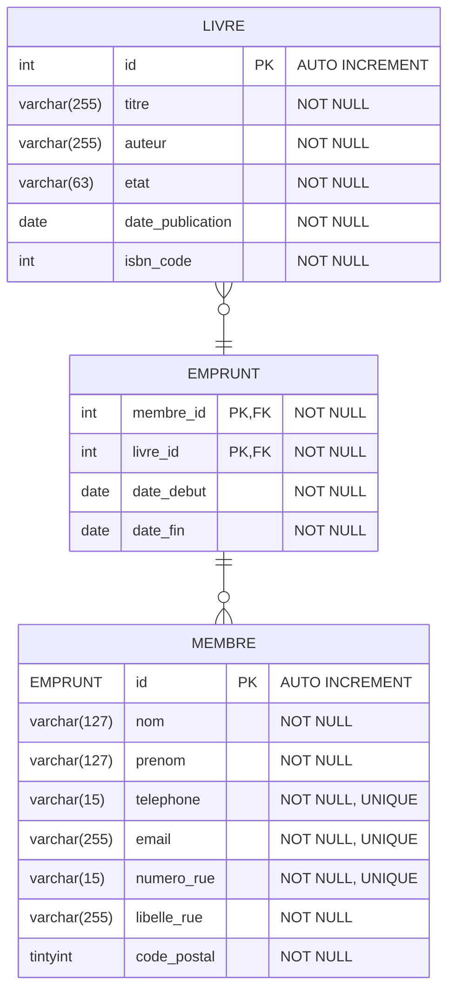
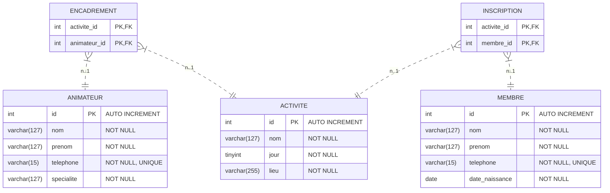

# Exercices - Conception de Bases de Données

## 2. Analyse du besoin client

### Exercice 2.1 - Facile
#### Temps estimé : 20~25min
**Contexte :** Un bibliothécaire souhaite informatiser sa petite bibliothèque de quartier.

**Demande client :** *"Nous aimerions moderniser la gestion de notre bibliothèque. Nous devons pouvoir enregistrer les livres avec leur titre, auteur, éditeur, date de publication et leur code ISBN. Chaque livre peut avoir plusieurs exemplaires, et nous devons suivre leur état (neuf, bon, usé) et leur disponibilité. Nos membres doivent être enregistrés avec leur nom, prénom, adresse, téléphone et adresse mail. Ils peuvent emprunter plusieurs livres, mais pas plus de cinq à la fois. Il faut savoir à quelle date un emprunt commence, quand le livre doit être rendu, et s’il a été effectivement retourné. On aimerait aussi consulter l’historique des emprunts d’un membre, et savoir quels livres sont les plus empruntés."*

**Questions :**
1. Identifiez les entités principales du système
2. Listez les attributs pour chaque entité identifiée
3. Construire un dictionnaire de données

**Réponses :**
1. Entités :
  - Livre
  - Membre
  - Emprunt
2. Attributs : 
  - Livre:
    - identifiant
    - titre
    - auteur
    - editeur
    - date de publication
    - code ISBN
    - etat
  - Membre: 
    - nom
    - prenom
    - numéro de rue
    - libellé de rue
    - cpd
    - téléphone
    - mail
  - Emprunt
    - date debut emprunt
    - date fin emprunt
    - livre
    - membre
3.
| **Entité** | **Attribut** | **Type** | **Taille** | **Description** | **Obligatoire** |
|:----------:|:------------:|:--------:|:----------:|:----------------|:---------------:|
| **Livre** | id | Entier | - | Identifiant unique | Oui |
| | titre | Text | 255 | Titre du livre | Oui |
| | auteur | Text | 255 | Nom auteur du livre | Non |
| | editeur | Text | 255 | Nom editeur du livre | Non |
| | date_publication | Date | - | Date publication du livre | Non |
| | code ISBN | Entier | 13 | Code isbn du livre | Non |
| | etat | Text | 127  | Etat du livre | oui |
| **Membre** | id | Entier | - | Identifiant unique | Oui |
| | nom | Text | 255 | Nom du membre | Oui |
| | prenom | Text | 255 | Prenom du membre | Oui |
| | telephone | Text | 12 | Numéro de téléphone  | Oui |
| | mail | Text | 255 | email  | Oui |
| | numero_rue | Text | 3 | Numéro de rue du membre  | Non |
| | libelle_rue | Text | 511 | Libbelé de rue du membre  | Oui |
| | code_postal | Entier | 5 | Code postale  | Oui |
| **Emprunt** | date_debut | Date | - | Date debut emprunt | Oui |
| | date_fin | Date | - | Date fin emprunt | Oui |
| | livre_emprunte | Entier | - | Numero du livre emprunte | Oui |
| | membre_emprunteur | Entier | - | Numero du membre qui emprunte | Oui |

---

### Exercice 2.2 - Facile
#### Temps estimé : ~15min
**Contexte :** Création d'un site e-commerce.

**Demande client :** *"Je voudrais vendre des objets en ligne, comme des bougies et des cadres. Chaque produit doit avoir un nom, un prix, une petite description et une quantité en stock. Les clients peuvent créer un compte avec leur nom, prénom, adresse mail et numéro de téléphone. Quand un client commande, je dois savoir quels produits il a achetés, en quelle quantité, et la date de la commande. Il faut aussi suivre le statut de la commande : en attente, envoyée ou livrée. Je veux pouvoir consulter l’historique des commandes de chaque client. Ce n’est pas un gros site, mais j’ai besoin que tout soit bien organisé."*

**Questions :**
1. Créer un dictionnaire (si c'est trop dur, faire comme l'*exercice 2.1*, liste entités, attributs, dictionnaire)
**Réponses :**

| **Entité** | **Attribut** | **Type** | **Taille** | **Description** | **Obligatoire** |
|:----------:|:------------:|:--------:|:----------:|:----------------|:---------------:|
| **Produit** | id | Entier | - | Identifiant unique | Oui |
| | nom | Text | 255 | Nom du produit | Oui |
| | description | Text | 511 | Description du produit | Non |
| | prix | Nombre à virgule (Réel) | 10,2 | Prix du produit | Oui |
| | quantite | Entier | - |  Quantite en stock | Oui |  
| **Cient** | id | Entier | - | Identifiant unique | Oui |
| | nom | Text | 255 | Nom du membre | Oui |
| | prenom | Text | 255 | Prenom du membre | Oui |
| | telephone | Text | 12 | Numéro de téléphone  | Oui |
| | mail | Text | 255 | email  | Oui |
| **Commande** | id | Entier | - | Identifiant unique | Oui |
| | produit | Entier | - | Référence du produit | Oui |
| | quantite | Entier | - | Quantité commandé | Oui |
| | statut | Text | - | Statut de la commande | Oui |
---

### Exercice 2.3 - Facile
#### Temps estimé : ~25min
**Contexte :** Une association sportive.

**Demande client :** *"Nous sommes une petite association sportive qui propose plusieurs activités comme le football, le tennis et le yoga. Chaque activité a un nom, un lieu où elle se pratique, et un jour de la semaine fixe. Les membres du club peuvent s’inscrire à une ou plusieurs activités. Pour chaque membre, nous voulons enregistrer le nom, le prénom, la date de naissance et le numéro de téléphone. Chaque activité est encadrée par un animateur, et certains animateurs encadrent plusieurs activités. Pour eux, on note leur nom, prénom et spécialité. Enfin, on aimerait pouvoir consulter la liste des inscrits pour chaque activité."*

**Questions :**
1. Créer un dictionnaire (si c'est trop dur, faire comme l'*exercice 2.1*, liste entités, attributs, dictionnaire)
**Réponses :**

| **Entité** | **Attribut** | **Type** | **Taille** | **Description** | **Obligatoire** |
|:----------:|:------------:|:--------:|:----------:|:----------------|:---------------:|
| **Activite** | id | Entier | - | Identifiant unique | Oui |
| | nom | Text | 255 | Nom de l'activité | Oui |
| | jour | Entier | - | Jour de la semaine ou l'activité se déroule | Oui |
| | lieu | Text | 255 | Lieu de l'activité | Oui |
| **Membre** | id | Entier | - | Identifiant unique | Oui |
| | nom | Text | 255 | Nom du membre | Oui |
| | prenom | Text | 255 | Prenom du membre | Oui |
| | telephone | Text | 12 | Numéro de téléphone  | Oui |
| | date_naissance | Date | - | Date de naissance du membre  | Oui |
| **Animateur** | id | Entier | - | Identifiant unique | Oui |
| | nom | Text | 255 | Nom du membre | Oui |
| | prenom | Text | 255 | Prenom du membre | Oui |
| | specialite | Text | 255 | Spécialité de l'animateur (ex : natation) | Oui |
| **Animation** | Animateur | Entier | - | Identifiant Animateur | Oui |
| | Activite | Entier | - | Identifiant Activite | Oui |
| **Inscription** | Membre | Entier | - | Identifiant Membre | Oui |
| | Activite | Entier | - | Identifiant Activite | Oui |
---

---

### Exercice 2.4 - Moyen
**Contexte :** Une clinique vétérinaire veut moderniser sa gestion.

**Demande client :** *"Je gère un petit hôtel de 15 chambres et j’aimerais mieux suivre mes réservations. Chaque chambre a un numéro, un type (simple, double, suite), et un tarif par nuit. Quand un client réserve, je dois enregistrer son nom, son mail, ses dates d’arrivée et de départ, et le nombre de personnes. Certains clients réservent plusieurs fois dans l’année, donc je veux pouvoir voir leur historique. Je souhaite aussi noter si la chambre a été nettoyée entre deux séjours. Enfin, je veux suivre l’état de la réservation : confirmée, annulée ou terminée."*

**Questions :**
1. Analysez cette demande complexe et identifiez toutes les entités
2. Créez un dictionnaire de données complet (minimum 6 entités)
3. Identifiez les données atomiques mal exprimées et proposez une correction
4. Quelles questions poseriez-vous au client pour clarifier certains points ?

---

### Exercice 2.5 - Difficile
**Contexte :** Plateforme de streaming musical multi-artistes.

**Demande client :** *"Nous organisons un festival musical sur trois jours, avec plusieurs scènes et de nombreux artistes. Chaque artiste a un nom, un style musical, et parfois un groupe associé. Les artistes se produisent sur une ou plusieurs scènes, à des créneaux horaires différents. Les spectateurs peuvent acheter des billets pour un jour ou pour l’ensemble du festival. Chaque billet donne accès à tous les concerts de la journée concernée. Je veux aussi suivre le nombre de places vendues par jour et par type de billet. Enfin, chaque scène a une capacité maximale à ne pas dépasser"*

**Questions :**
1. Effectuez une analyse complète du besoin (identifiez les entités principales et secondaires)
2. Créez un dictionnaire de données exhaustif
3. Identifiez les contraintes métier complexes (ex: gestion des droits, qualité audio)
4. Proposez 5 questions pertinentes à poser au client pour affiner le cahier des charges

---

## 3. Diagramme Entité-Relation (ERD)
Pour faire l'ERD plusieurs choix s'offrent à vous : mermaid, lucidchart, miro, ou autre.

### Exercice 3.1 - Facile
#### Temps estimé : ~17min
**Contexte :** Reprise de l'exercice 2.1 - Gestion d'une petite bibliothèque de quartier.

**Données :**
- Dictionnaire de données de l'exercice 2.1


**Questions :**

1. Dessinez l'ERD en respectant les relations entre membres, emprunts et exemplaires
2. Quelle relation modélise l'historique d'un membre ?

**Réponses :**


---

### Exercice 3.2 - Facile
#### Temps estimé : ~15min
**Contexte :** Reprise de l'exercice 2.2 - Mini site e-commerce.

**Données :**
- Dictionnaire de données de l'exercice 2.2

**Questions :**

1. Modélisez l'ERD avec une entité associative pour les lignes de commande
2. Identifiez les clés primaires

**Réponses :**

---

### Exercice 3.3 - Facile
#### Temps estimé : ~20min
**Contexte :** Reprise de l'exercice 2.3 - Association sportive.

**Données :**
- Dictionnaire de données de l'exercice 2.3


**Questions :**

1. Créez l'ERD en incluant les relations membre/activité et activité/animateur
2. Comment modéliser les animateurs encadrant plusieurs activités ?

**Réponses :**

---

### Exercice 3.4 - Moyen

**Contexte :** Reprise de l'exercice 2.4 - Système de réservation d'un hôtel.

**Données :**
- Dictionnaire de données de l'exercice 2.4

**Questions :**

1. Créez un ERD intégrant les entités et leurs attributs
2. Modélisez la relation entre réservation et chambre
3. Quelle solution proposez-vous pour éviter les conflits de réservation sur une même chambre ?

---

### Exercice 3.5 - Difficile

**Contexte :** Reprise de l'exercice 2.5 - Festival de musique.

**Données :**

- Dictionnaire de données de l'exercice 2.5

**Questions :**

1. Créez l'ERD complet à partir du dictionnaire de données
2. Ajoutez les relations entre artistes, groupes et concerts
3. Comment gérer les limites de capacité des scènes ?
4. Comment modéliser les concerts à horaires multiples sans redondance ?
5. Bonus : Proposez un moyen de suivre les ventes par type de billet et jour

---

## 4. Modèle Conceptuel de Données (MCD)

### Exercice 4.1 - Facile
#### Temps estimé : ~20min
**Contexte :** Bibliothèque municipale.

**Relations données :**
- Un membre emprunte plusieurs livres
- Un livre peut être emprunté par un seul lecteur à la fois
- Un livre peut ne pas être emprunté

**Questions :**
1. Déterminez les cardinalités de la relation MEMBRE-LIVRE
2. Représentez le MCD avec notation Merise

**Réponses :**
- Relation Livre ↔ Emprunt
  - Cardinalité (1,1) côté Livre :
    - "Chaque emprunt concerne un et un seul livre"
- Cardinalité (0,n) côté Emprunt :
  - "Un livre peut faire l'objet de zéro à plusieurs emprunts (aucun emprunt si le livre n'a jamais été emprunté, ou plusieurs emprunts successifs dans le temps)"
- Relation Membre ↔ Emprunt
  - Cardinalité (1,1) côté Membre :
    - "Chaque emprunt est effectué par un et un seul membre"
  - Cardinalité (0,n) côté Emprunt :
    - "Un membre peut effectuer zéro à plusieurs emprunts (aucun s'il n'a jamais emprunté, ou plusieurs emprunts au fil du temps)"

En résumé pratique :
- Un emprunt = 1 livre + 1 membre (d'où les (1,1))
- Un livre peut être dans plusieurs emprunts différents au fil du temps
- Un membre peut faire plusieurs emprunts différents au fil du temps


---

### Exercice 4.2 - Facile
**Contexte :** Mini E-Commerce.

**Données :**
- Créer la table relation commande-produit
- Un produit peut être dans plusieurs ou aucun commande
- Une commande possède au moins 1 produit


**Questions :**
1. Analysez les cardinalités
2. Créez le MCD correspondant

**Réponses :**
- Relation Client ↔ Commande
  - Cardinalité (0,n) côté Client :
    - "Un client peut passer zéro à plusieurs commandes (aucune s'il vient de s'inscrire, ou  plusieurs commandes au fil du temps)"
  - Cardinalité (1,1) côté Commande :
    - "Chaque commande est passée par un et un seul client"
- Relation Commande ↔ Commande-Produit
  - Cardinalité (1,1) côté Commande :
    - "Chaque ligne de commande (Commande-Produit) appartient à une et une seule commande"
  - Cardinalité (0,n) côté Commande-Produit :
    - "Une commande peut contenir zéro à plusieurs lignes de produits (théoriquement zéro, mais en pratique au moins 1 ligne)"
- Relation Produit ↔ Commande-Produit
  - Cardinalité (1,1) côté Produit :
    - "Chaque ligne de commande (Commande-Produit) concerne un et un seul produit"
  - Cardinalité (0,n) côté Commande-Produit :
    - "Un produit peut apparaître dans zéro à plusieurs lignes de commandes (aucune s'il n'a jamais été commandé, ou plusieurs fois dans différentes commandes)"

En résumé pratique :
- Un client peut avoir plusieurs commandes
- Une commande appartient à un seul client
- Une commande contient plusieurs lignes (produits + quantités)
- Un produit peut être commandé plusieurs fois par différents clients


---

### Exercice 4.3 - Facile
**Contexte :** Une association sportive.

**Relations :**
- Un membre peut pratiquer plusieurs activités
- Un animateur anime au moins une activité

**Questions :**

1. Créez le MCD complet avec les bonnes cardinalités

**Réponses :**
- Relation Animateur ↔ Activité (via "encadre")
  - Cardinalité (1,n) côté Animateur :
    - "Un animateur doit encadrer au moins une activité et peut en encadrer plusieurs (comme mentionné : 'certains animateurs encadrent plusieurs activités')"
    - Cardinalité (1,1) côté Activité :
      - "Chaque activité est encadrée par un et un seul animateur"
- Relation Membre ↔ Activité (via "participe")
  - Cardinalité (0,n) côté Membre :
    - "Un membre peut s'inscrire à zéro à plusieurs activités (comme mentionné : 'peuvent s'inscrire à une ou plusieurs activités')"
  - Cardinalité (1,n) côté Activité :
    - "Chaque activité doit avoir au moins un membre inscrit et peut en avoir plusieurs"


---

### Exercice 4.4 - Moyen
**Contexte :** Plateforme de e-learning.

**Spécifications :**
- Un étudiant peut s'inscrire à plusieurs cours
- Un cours peut accueillir plusieurs étudiants
- Chaque inscription a une date et peut avoir une note finale
- Un professeur peut enseigner plusieurs cours
- Un cours est enseigné par un seul professeur
- Certains cours peuvent être préparés mais pas encore ouverts

**Questions :**
1. Analysez toutes les relations et leurs cardinalités
2. Identifiez les relations complexes nécessitant une table de liaison
3. Créez le MCD complet avec toutes les cardinalités
4. Ajoutez les attributs pertinents pour chaque entité et association

---

### Exercice 4.5 - Difficile
**Contexte :** Système de gestion d'un réseau de magasins.

**Spécifications complexes :**
- Plusieurs magasins dans différentes villes
- Chaque magasin a un stock de produits différent
- Les employés travaillent dans un magasin mais peuvent être transférés
- Les fournisseurs livrent des produits à plusieurs magasins
- Les clients peuvent acheter dans n'importe quel magasin
- Système de fidélité unifié entre magasins
- Promotions peuvent être globales ou spécifiques à un magasin

**Questions :**
1. Identifiez toutes les entités (minimum 8) et leurs attributs
2. Analysez toutes les relations et déterminez leurs cardinalités
3. Créez le MCD complet avec justification des choix de cardinalités
4. Gérez la complexité du stock par magasin et par produit
5. Comment gérez-vous les transferts d'employés dans le modèle ?
6. Intégrez le système de promotions avec ses contraintes

---

## 5. Modèle Logique de Données (MLD)

### Exercice 5.1 - Facile
#### Temps estimé : ~20min
**Contexte :** Reprise de l'exercice 4.1 - Gestion d'une petite bibliothèque de quartier.


**Questions :**
1. Transformez ce MCD en MLD
2. Identifiez les clés primaires et étrangères
3. Où placez-vous les clés étrangères et pourquoi ?

**Réponses :**

Clés primaires :
  - LIVRE.id (PK)
  - MEMBRE.id (PK)
  - EMPRUNT.membre_id + livre_id (PK composite)

Clés étrangères :
  - EMPRUNT.membre_id → MEMBRE.id (FK)
  - EMPRUNT.livre_id → LIVRE.id (FK)

Placement des clés étrangères
Les clés étrangères sont placées dans la table EMPRUNT car :

- Règle générale : Dans une relation 1,1 ↔ 0,n, les FK vont du côté "n"
- Logique métier : Un emprunt DOIT référencer un livre ET un membre
- Évite la redondance : Pas de champs NULL dans LIVRE ou MEMBRE
- Performance : Jointures optimisées pour les requêtes d'historique


---

### Exercice 5.2 - Facile
#### Temps estimé : ~18min
**Contexte :** Reprise de l'exercice 4.2 - Mini site e-commerce.

**MCD de référence (exercice 4.2) :**
- PRODUIT (id, nom, description, prix, quantite)
- CLIENT (id, nom, prenom, telephone, mail)
- COMMANDE (id, date_commande, statut, client_id)
- LIGNE_COMMANDE (commande_id, produit_id, quantite, prix_unitaire)

**Relations :**
- CLIENT ↔ COMMANDE (1,1)-(0,n)
- COMMANDE ↔ LIGNE_COMMANDE (1,1)-(1,n)
- PRODUIT ↔ LIGNE_COMMANDE (1,1)-(0,n)

**Questions :**
1. Créez le MLD correspondant
2. Gérez la relation n,n entre COMMANDE et PRODUIT via LIGNE_COMMANDE
3. Quelles sont les clés primaires composites nécessaires ?
4. Comment assurez-vous qu'une commande contient au moins un produit ?

**Réponses :**
2. La relation many-to-many est gérée par la table LIGNE_COMMANDE qui :
- Contient les clés étrangères vers COMMANDE et PRODUIT
- Stocke les informations spécifiques à chaque ligne (quantité)

3. Une seule clé primaire composite est nécessaire :
- LIGNE_COMMANDE : (commande_id, produit_id)
- Cette combinaison garantit qu'un même produit ne peut apparaître qu'une fois par commande

4. Au niveau du MLD, cette contrainte se traduit par :
- Cardinalité (1,n) entre COMMANDE et LIGNE_COMMANDE
  - Cela signifie qu'une commande doit avoir AU MOINS une ligne de commande
  - Techniquement, cette contrainte sera implémentée par des règles métier dans l'application ou des triggers en base de données


---

### Exercice 5.3 - Facile
#### Temps estimé : ~22min
**Contexte :** Reprise de l'exercice 4.3 - Association sportive.

**Relations :**
- ANIMATEUR ↔ ACTIVITE (1,n)-(1,1) via ANIMATION
- MEMBRE ↔ ACTIVITE (0,n)-(1,n) via INSCRIPTION

**Questions :**
1. Transformez toutes les relations en MLD
2. Identifiez les tables de liaison nécessaires
3. Gérez les clés primaires composites pour les relations n,n
4. Comment empêchez-vous qu'un membre s'inscrive deux fois à la même activité ?

**Réponses :**


---

### Exercice 5.4 - Moyen
#### Temps estimé : ~30min
**Contexte :** Reprise de l'exercice 2.4 - Système de réservation d'hôtel.

**Données du contexte :**
*"Je gère un petit hôtel de 15 chambres et j'aimerais mieux suivre mes réservations. Chaque chambre a un numéro, un type (simple, double, suite), et un tarif par nuit. Quand un client réserve, je dois enregistrer son nom, son mail, ses dates d'arrivée et de départ, et le nombre de personnes. Certains clients réservent plusieurs fois dans l'année, donc je veux pouvoir voir leur historique. Je souhaite aussi noter si la chambre a été nettoyée entre deux séjours. Enfin, je veux suivre l'état de la réservation : confirmée, annulée ou terminée."*

**Entités identifiées :**
- CHAMBRE (id, numero, type, tarif_nuit, statut_nettoyage)
- CLIENT (id, nom, email, telephone)
- RESERVATION (id, date_arrivee, date_depart, nb_personnes, statut, client_id, chambre_id)

**Questions :**
1. Analysez les relations et créez le MLD complet
2. Gérez les contraintes temporelles (pas de réservations qui se chevauchent)
3. Comment gérez-vous l'historique des réservations d'un client ?
4. Ajoutez une entité pour le suivi du nettoyage des chambres
5. Quelles clés étrangères sont nécessaires et où les placer ?

---

### Exercice 5.5 - Difficile
#### Temps estimé : ~45min
**Contexte :** Reprise de l'exercice 2.5 - Festival de musique.

**Entités complexes identifiées :**
- ARTISTE (id, nom, style_musical, groupe_id)
- GROUPE (id, nom, style_principal)
- SCENE (id, nom, capacite_max, emplacement)
- CONCERT (id, date_concert, heure_debut, heure_fin, artiste_id, scene_id)
- BILLET (id, type_billet, prix, date_achat, spectateur_nom, spectateur_email)
- JOUR_FESTIVAL (id, date_jour, theme)
- ACCES_BILLET (billet_id, jour_id) // pour les billets multi-jours

**Questions :**
1. Créez le MLD complet en gérant toutes les relations complexes
2. Gérez la relation optionnelle ARTISTE-GROUPE (auto-référence)
3. Comment évitez-vous les conflits d'horaires sur une même scène ?
4. Gérez les billets "jour" vs "festival complet" avec leurs accès
5. Assurez-vous que la capacité des scènes n'est pas dépassée
6. Ajoutez une table pour suivre les ventes par type de billet et par jour
7. Comment gérez-vous les artistes qui se produisent plusieurs fois ?

---

## 6. Modèle Physique de Données (MPD)

### Exercice 6.1 - Facile
#### Temps estimé : ~20min
**Contexte :** Reprise de l'exercice 5.1 - Gestion d'une petite bibliothèque de quartier.

**MLD de référence :**
- LIVRE (id, titre, auteur, editeur, date_publication, code_ISBN, etat)
- MEMBRE (id, nom, prenom, telephone, mail, numero_rue, libelle_rue, code_postal)
- EMPRUNT (id, date_debut, date_fin, date_retour_reel, livre_id, membre_id)

**Questions :**
1. Transformez en MPD avec types SQL appropriés
2. Définissez les tailles de champs appropriées (VARCHAR, etc.)
3. Ajoutez les contraintes NOT NULL nécessaires

**Réponses :**

---

### Exercice 6.2 - Facile
#### Temps estimé : ~18min
**Contexte :** Reprise de l'exercice 5.2 - Mini site e-commerce.

**MLD de référence :**
- PRODUIT (id, nom, description, prix, quantite)
- CLIENT (id, nom, prenom, telephone, mail)
- COMMANDE (id, date_commande, statut, client_id)
- LIGNE_COMMANDE (commande_id, produit_id, quantite, prix_unitaire)

**Questions :**
1. Créez le MPD avec types précis pour les prix (DECIMAL)
2. Définissez les contraintes de clés étrangères avec CASCADE/RESTRICT appropriés
3. Ajoutez les contraintes CHECK (prix > 0, quantite >= 0)
4. Gérez les contraintes UNIQUE (email client)

**Réponses :**

```mermaid
erDiagram
  PRODUIT {
    int id PK "AUTO INCREMENT"
    varchar(127) nom "NOT NULL"
    decimal(10, 2) prix "NOT NULL, CHECK (prix > 0)"
    varchar(511) description "NOT NULL"
    int stock "NOT NULL, CHECK (stock >= 0)"
  }
  COMMANDE {
    int id PK "AUTO INCREMENT"
    int client_id FK "NOT NULL"
    varchar(63) statut "NOT NULL"
    date date_commande "NOT NULL"
  }
  CLIENT {
    int id PK "AUTO INCREMENT"
    varchar(127) nom "NOT NULL"
    varchar(127) prenom "NOT NULL"
    varchar(15) telephone "NOT NULL, UNIQUE"
  }
  LIGNE_COMMANDE {
    int commande_id PK, FK
    int produit_id PK, FK
    int quantite "CHECK (quantite >= 1)"
  }

  PRODUIT ||--|| LIGNE_COMMANDE : ""
  LIGNE_COMMANDE ||--o{ COMMANDE : ""
  COMMANDE||--o{ CLIENT : ""
```
---

### Exercice 6.3 - Facile
#### Temps estimé : ~22min
**Contexte :** Reprise de l'exercice 5.3 - Association sportive.

**MLD de référence :**
- ACTIVITE (id, nom, jour, lieu)
- MEMBRE (id, nom, prenom, telephone, date_naissance)
- ANIMATEUR (id, nom, prenom, specialite)
- INSCRIPTION (membre_id, activite_id, date_inscription)
- ANIMATION (animateur_id, activite_id)

**Questions :**
1. Définissez le MPD
2. Gérez les clés primaires composites pour les tables de liaison
3. Ajoutez les contraintes d'intégrité référentielle
4. Créez des contraintes pour éviter les doublons dans les inscriptions

**Réponses :**



---

### Exercice 6.4 - Moyen
#### Temps estimé : ~35min
**Contexte :** Reprise de l'exercice 5.4 - Système de réservation d'hôtel.

**MLD de référence :**
- CHAMBRE (id, numero, type, tarif_nuit, statut_nettoyage)
- CLIENT (id, nom, email, telephone)
- RESERVATION (id, date_arrivee, date_depart, nb_personnes, statut, client_id, chambre_id)
- NETTOYAGE (id, chambre_id, date_nettoyage, employe_responsable, statut)

**Questions :**
1. Créez le MPD complet avec types SQL précis
2. Gérez les contraintes temporelles complexes (pas de chevauchement de réservations)
3. Ajoutez des contraintes CHECK pour les dates (départ > arrivée)
4. Définissez des triggers pour vérifier la disponibilité des chambres
5. Créez des index composites pour les recherches par période
6. Gérez les contraintes d'intégrité avec les bonnes politiques de suppression
7. Ajoutez une contrainte pour que nb_personnes ne dépasse pas la capacité du type de chambre

---

### Exercice 6.5 - Difficile
#### Temps estimé : ~50min
**Contexte :** Reprise de l'exercice 5.5 - Festival de musique.

**MLD complexe de référence :**
- ARTISTE (id, nom, style_musical, groupe_id)
- GROUPE (id, nom, style_principal)
- SCENE (id, nom, capacite_max, emplacement)
- CONCERT (id, date_concert, heure_debut, heure_fin, artiste_id, scene_id)
- BILLET (id, type_billet, prix, date_achat, spectateur_nom, spectateur_email)
- JOUR_FESTIVAL (id, date_jour, theme)
- ACCES_BILLET (billet_id, jour_id)
- VENTE_STATS (id, jour_id, type_billet, nb_vendus, ca_realise)

**Spécifications techniques complexes :**
- Gestion des horaires avec précision (DATETIME)
- Contraintes de capacité par scène
- Éviter les conflits d'horaires
- Calculs automatiques des statistiques de vente
- Optimisation pour les recherches fréquentes

**Questions :**
1. Créez le MPD complet avec tous les types SQL appropriés
2. Gérez l'auto-référence ARTISTE-GROUPE avec contrainte appropriée
3. Ajoutez des contraintes complexes pour éviter les conflits d'horaires sur une même scène
4. Créez des triggers pour :
   - Vérifier que la capacité des scènes n'est pas dépassée
   - Calculer automatiquement les statistiques de vente
   - Empêcher les concerts qui se chevauchent
5. Définissez des index composites pour optimiser :
   - Recherche de concerts par jour et scène
   - Statistiques de vente par type de billet
   - Historique des concerts d'un artiste
6. Gérez les contraintes CHECK complexes (heure_fin > heure_debut, prix > 0)
7. Ajoutez une stratégie de partitioning pour les tables volumineuses (BILLET, VENTE_STATS)
8. Bonus : Proposez un système de réservation de places avec gestion d'attente